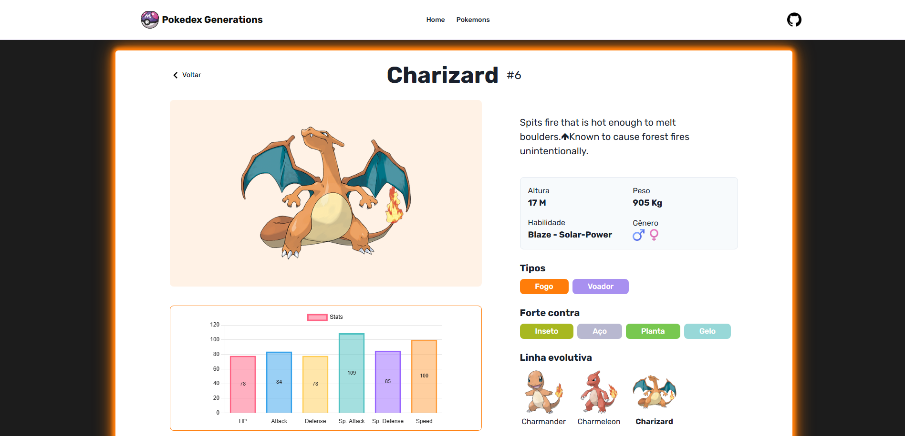

# Pokédex Generations

[]([https://seu-usuario.github.io/sua-pokedex](https://github.com/lucas-albieri/pokedex))

> [Acesse o projeto online](https://pokedex-zeta-inky.vercel.app/)

Uma Pokédex interativa criada para exibir informações detalhadas dos Pokémon. Este projeto foi desenvolvido utilizando tecnologias modernas de frontend para proporcionar uma experiência dinâmica e visualmente atrativa.

## 🔍 Funcionalidades

- **Pesquisa por Pokémon**: Busque Pokémon pelo nome na Pokédex.
- **Exibição de Detalhes**: Informações detalhadas como tipo, habilidades e estatísticas de batalha (HP, Ataque, Defesa, etc.).
- **Gráficos de Status**: Visualização gráfica das estatísticas de cada Pokémon usando gráficos de radar.
- **Imagens em Alta Resolução**: Mostra sprites de cada Pokémon.

## 🛠 Tecnologias Utilizadas

- **React** com **Chakra UI** para a interface de usuário.
- **GraphQL** e **Apollo Client** para consultas na **PokeAPI**.
- **Chart.js** integrado com **react-chartjs-2** para gráficos de status dos Pokémon.
- **LINGVA** para traduzir as descrições dos Pokemons - obs: Biblioteca sujeita a instabilidade

## 🚀 Como Executar o Projeto

1. Clone o repositório:
   ```bash
   git clone https://github.com/lucas-albieri/pokedex
   cd pokedex
   
